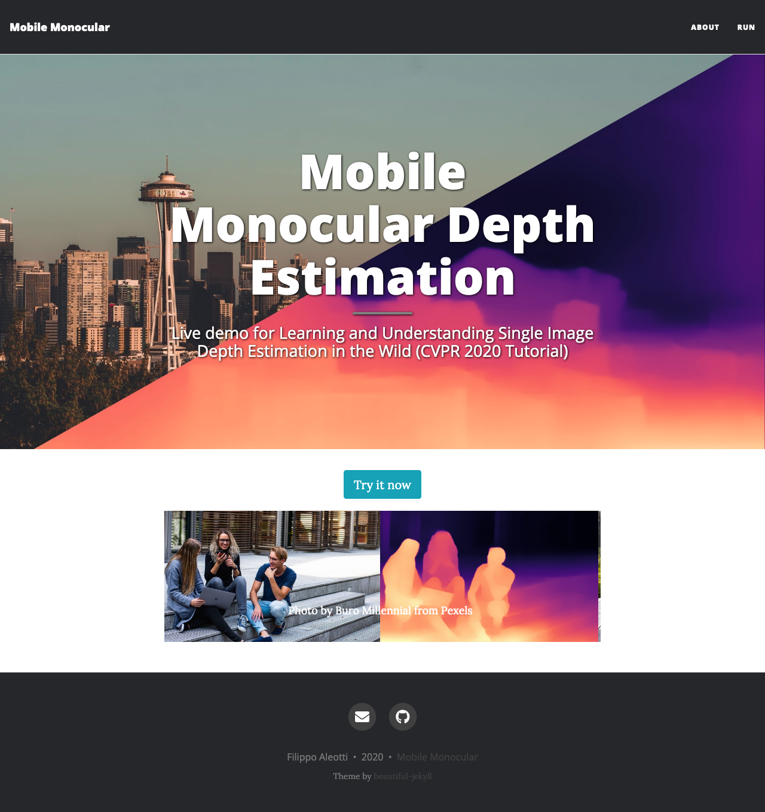

# PyDNet on mobile devices v2.0
This repository contains the source code to run PyDNet on mobile devices.

# What's new?
In v2.0, we changed the procedure and the data used for training. More information will be provided soon...

Moreover, we build also a web-based demonstration of the same network! You can try it now [here](https://filippoaleotti.github.io/demo_live/).
The model runs directly on your browser, so anything to install! 

<p align="center">
  
</p>

## iOS
The iOS demo has been developed by [Giulio Zaccaroni](https://github.com/GZaccaroni).

XCode is required to build the app, moreover you need to sign in with your AppleID and trust yourself as certified developer.

<div class="container">
<div class="row">
<div class="col-md-6">

</div>
<div class="col-md-6">

</div>
</div>
</div>


## Android
The code will be released soon

# License
Code is licensed under APACHE version 2.0 license.
Weights of the network can be used for research purposes only.

# Contacts and links
If you use this code in your projects, please cite our paper:

```
@inproceedings{pydnet18,
  title     = {Towards real-time unsupervised monocular depth estimation on CPU},
  author    = {Poggi, Matteo and
               Aleotti, Filippo and
               Tosi, Fabio and
               Mattoccia, Stefano},
  booktitle = {IEEE/JRS Conference on Intelligent Robots and Systems (IROS)},
  year = {2018}
}
```

More info about the work can be found at these links:
* [PyDNet paper](https://arxiv.org/pdf/1806.11430.pdf)
* [PyDNet code](https://github.com/mattpoggi/pydnet)

For questions, please send an email to filippo.aleotti2@unibo.it
