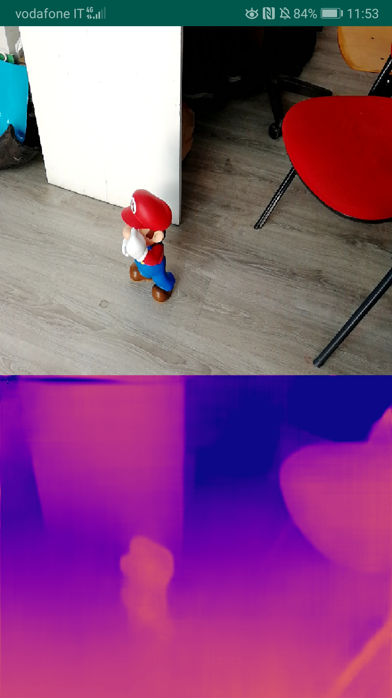
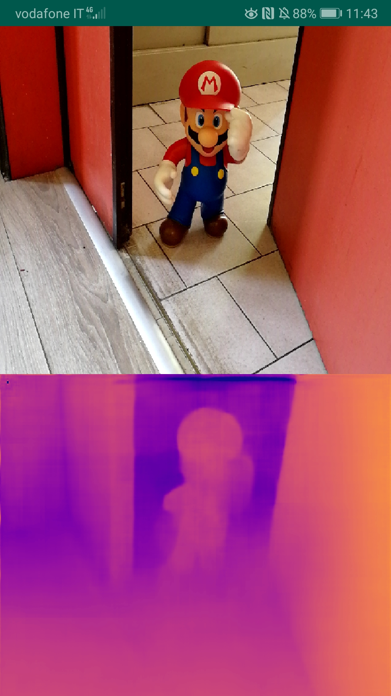
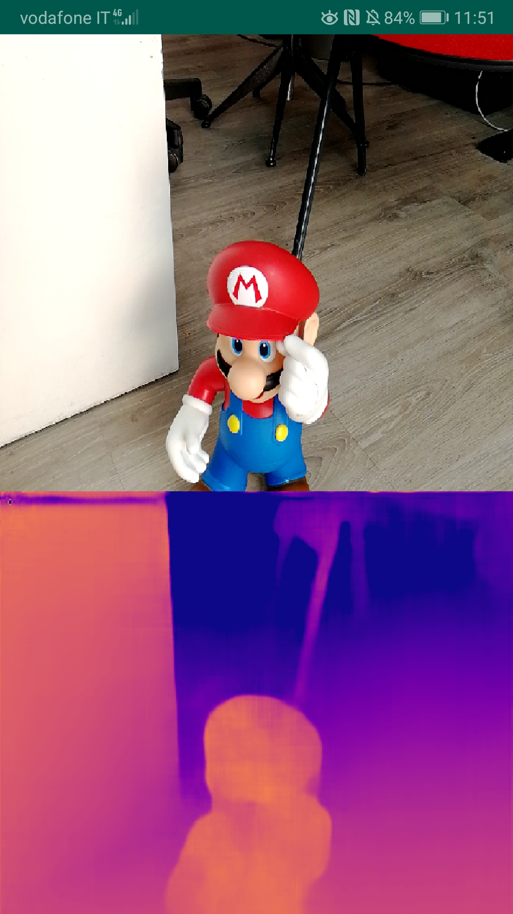
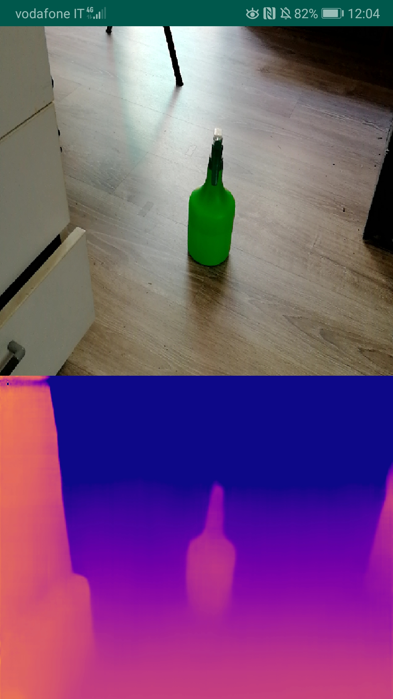

# PyDNet on mobile devices

This repository contains the source code to run PyDNet on mobile devices (`Android` and `iOS`)

If you use this code in your projects, please cite our paper:

```
@inproceedings{pydnet18,
  title     = {Towards real-time unsupervised monocular depth estimation on CPU},
  author    = {Poggi, Matteo and
               Aleotti, Filippo and
               Tosi, Fabio and
               Mattoccia, Stefano},
  booktitle = {IEEE/JRS Conference on Intelligent Robots and Systems (IROS)},
  year = {2018}
}
```

More info about the work can be found at these links:
* [PyDNet paper](https://arxiv.org/pdf/1806.11430.pdf)
* [PyDNet code](https://github.com/mattpoggi/pydnet)

## Model
The network has been trained on [MatterPort](https://matterport.com/it/) dataset for 1.2M steps, using the HuBer loss on disparity labels offered by the dataset as supervision.

<p align="center">
  
  
</p>
<p align="center">
  
  
</p>

## Android
The code is based on [Google android examples](https://github.com/tensorflow/tensorflow/tree/master/tensorflow/examples/android).
Android `target` version is 26 while `minimum` is 21. Android Studio is required.

Currently, we use `tensorflow-android` instead of `tf-lite`, and no gpu-optimisation is supported.

## iOS
The demo on iOS has been developed by Giulio Zaccaroni.
XCode is required to build the app, moreover you need to sign in with your AppleID and trust yourself as certified developer.

## License
The code provided in this repository has a demonstrative purpose only. You can download, modify and try it on your mobile phone with no restrictions. However, the trained model can not be used for scopes not covered by the [MatterPort’s](https://matterport.com/it/) license.
